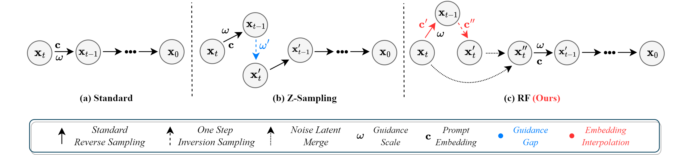
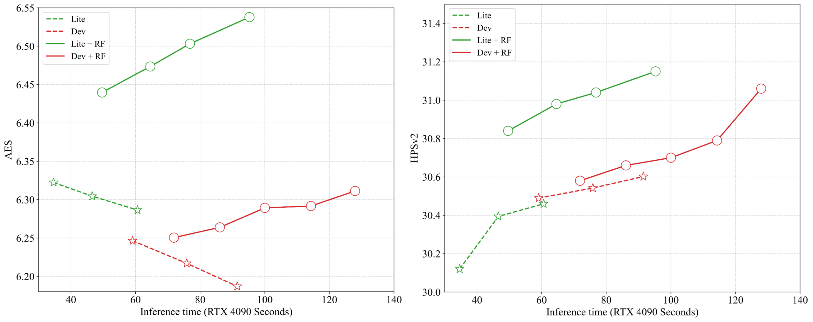

# Inference Enhancement for Flow-based Diffusion Models


In this repo, we propose a novel training-free inference enhancement method for flow-based diffusion model, like FLUX and SD3.5. The brief paradigm of our method is illustrated below:



The performance of our method is shown below:



Besides, our method can easily integrate with Lora:


**More experiments and more details, please wait for the coming report!**

## How to use 😄 

You just need to install the latest version of diffusers !!!


### Usage👀️ 

To use our method, you just need to take care of several parameters:

- `--inv_steps`: Should be consistent with the inference step.
- `--merge-ratio`: Default is 0.5.
- `--offset`: FLUX Lite is 2, Dev is 1, and SD3.5 is 1.
- `[--cfg-left, --cfg-right]`: FLUX Lite and SD3.5 should be [9, -1], and FLUX Dev should be [3.5, 0].

#### Output🎉️ 

The script will save three images:

- A standard image generated by the diffusion model.
- A optim image generated by the diffusion model with our method.
- A image consists of standard one and optimal one.

All images will be saved in the current directory with names based on the model and prompt.


### Citation:
If you find our code useful for your research, please cite our paper.

```
@misc{zhou2025freelunchflux,
      title={Free Lunch for Flow-based Diffusion Models}, 
      author={Zikai Zhou and Shitong Shao and Dian Xie and Lichen Bai and Zeke Xie},
      year={2025},
      url={https://arxiv.org/abs/2411.09502}, 
}
```

---


